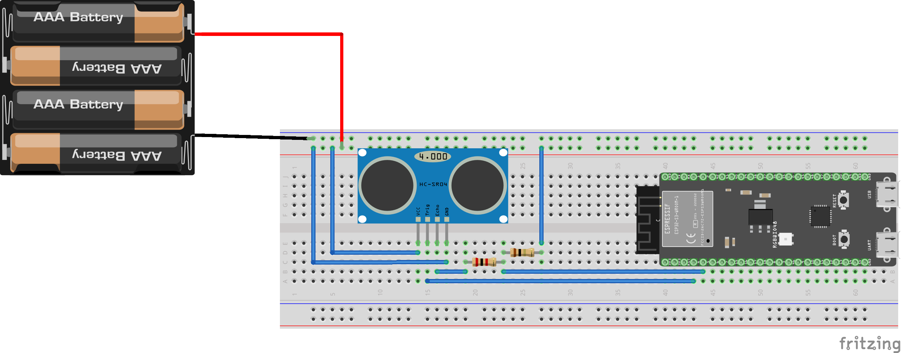
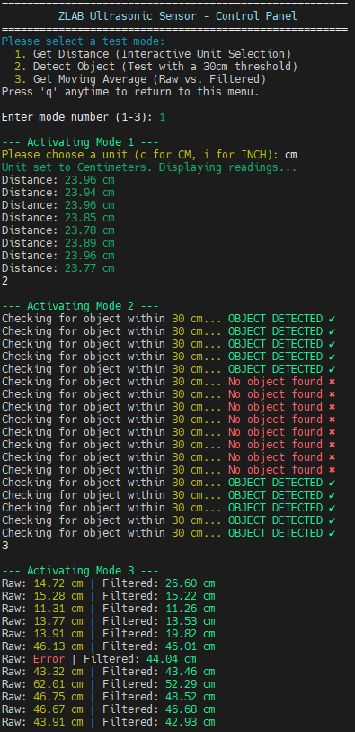

# 📡 ZlabUltrasonic – Advanced HC-SR04 Arduino Library

<div align="center">
🎯 <b>Accurate • Robust • Easy-to-Use</b><br>
Measure distances with <b>HC-SR04</b> like a pro!<br>
Includes <b>temperature compensation</b>, <b>moving average filtering</b>, and <b>interactive test menu</b>.
</div>

---

## 📖 Table of Contents
- 🌟 [Overview](#-overview)
- ⚡ [Key Features](#-key-features)
- 📊 [Technical Details](#-technical-details)
- 🎯 [What Makes This Special](#-what-makes-this-special)
- 🖼️ [Gallery](#-gallery)
- 🚀 [Getting Started](#-getting-started)
- 💻 [Example Output](#-example-output)
- 📚 [Documentation](#-documentation)
- 🤝 [Contributing](#-contributing)
- 📄 [License](#-license)

---

## 🌟 Overview
**ZlabUltrasonic** is a modern, well-documented C++ Arduino library for the **HC-SR04 ultrasonic distance sensor**.  
It goes beyond basic distance measurement by adding:
- Ambient temperature compensation for speed-of-sound accuracy
- Noise reduction using moving averages
- Built-in object detection logic
- Interactive serial monitor control panel for testing

Perfect for robotics, automation, and educational projects.

---

## ⚡ Key Features
✅ **Simple API** – Just create a sensor object and call `.getDistance()`  
🌡 **Temperature Compensation** – Adjusts speed of sound for accuracy  
📉 **Noise Filtering** – `getMovingAverageDistance()` for smooth readings  
🎯 **Threshold Detection** – `.isObjectDetected()` for presence sensing  
🖥 **Interactive Menu** – Change modes without re-uploading code  
📏 **Supports CM & Inches** – Flexible unit output

---

## 📊 Technical Details

| Feature                | Description |
|------------------------|-------------|
| **Sensor**             | HC-SR04 Ultrasonic |
| **MCU**                | Any Arduino-compatible board |
| **Pins Required**      | TRIG (output), ECHO (input) |
| **Temperature Input**  | User-provided via `setTemperature()` |
| **Max Range**          | ~4 meters (sensor-dependent) |
| **Resolution**         | ~0.3 cm |
| **Timeout**            | 30 ms (prevents blocking) |
| **Filtering**          | Moving average over 100 ms |
| **Units**              | Centimeters or Inches |

---

## 🎯 What Makes This Special
- 🏎 **Fast & Non-Blocking** – Optimized pulse reading with timeout  
- 🎓 **Educational** – Clear, commented source code for learning sensor programming  
- 🔌 **Drop-In Ready** – Minimal setup for beginners, flexibility for experts  
- 📏 **Accurate** – Adjusts for ambient temperature to improve measurements  
- 🛡 **Error Handling** – Returns negative values on timeout or invalid readings

---

## 🖼️ Gallery

**1️⃣ Wiring Setup – Sensor Placement & Distance**  
<p align="center">
  
  <br><i>HC-SR04 connected to Arduino (D5 = TRIG, D6 = ECHO)</i>
</p>

**2️⃣ Serial Monitor – Live Output**  
<p align="center">
  
  <br><i>Example output from interactive test menu</i>
</p>

---

## 🚀 Getting Started

### 1️⃣ Hardware Setup
- Connect **TRIG pin** of HC-SR04 → Arduino **D5**
- Connect **ECHO pin** of HC-SR04 → Arduino **D6**
- Power sensor with **+5V** and **GND**

### 2️⃣ Installation
- Copy `ZlabUltrasonic.h` and `ZlabUltrasonic.cpp` into your Arduino `libraries/ZlabUltrasonic` folder
- Restart Arduino IDE

### 3️⃣ Example Code
```cpp
#include "ZlabUltrasonic.h"

ZlabUltrasonic sensor(5, 6); // TRIG, ECHO

void setup() {
    Serial.begin(115200);
    sensor.setTemperature(25.0); // Optional: adjust for ambient temp
}

void loop() {
    float distance = sensor.getDistance(Unit::CM);
    if (distance > 0) {
        Serial.print("Distance: ");
        Serial.print(distance);
        Serial.println(" cm");
    } else {
        Serial.println("Error reading sensor");
    }
    delay(500);
}
---
##💻 Example Output
Mode 1 – Distance Measurement


Distance: 25.42 cm
Distance: 25.38 cm
Distance: 25.41 cm
Mode 2 – Object Detection (30cm threshold)


Checking for object within 30 cm... OBJECT DETECTED ✔
Checking for object within 30 cm... No object found ✖
Mode 3 – Moving Average

Raw: 25.40 cm | Filtered: 25.38 cm
---
##📚 Documentation
getDistance(Unit unit = Unit::CM) → Returns measured distance

isObjectDetected(float threshold_cm) → Checks if object is within threshold

getMovingAverageDistance(int sample_interval_ms = 10) → Returns stable average distance

setTemperature(float tempC) → Adjusts for environmental conditions
---
##🤝 Contributing
We welcome contributions!

Open issues for bugs or feature requests

Fork the repo, create a branch, and submit a PR

Improve docs, add examples, or optimize code
---
##📄 License
This project is licensed under the MIT License – see LICENSE for details.
---
